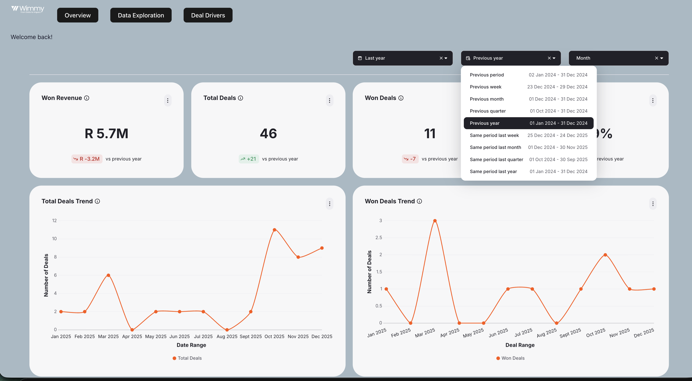
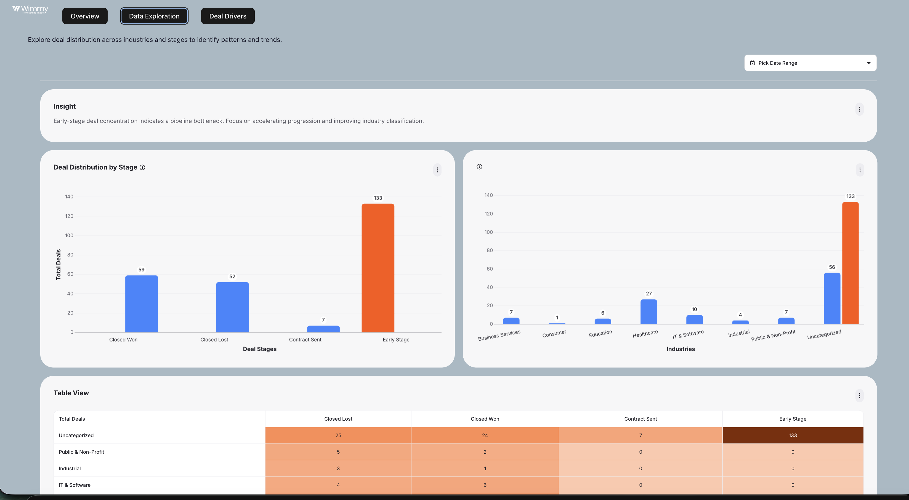
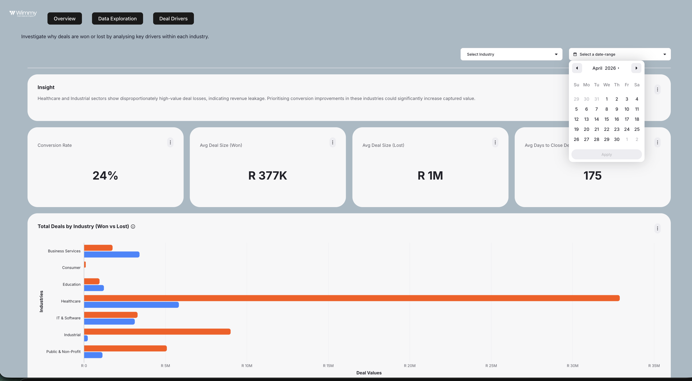

# Full-Stack Analytics Dashboard

## Overview
This project is a full-stack analytics dashboard built to track and explore business performance using real-world data. It provides key performance indicators (KPIs), interactive filtering, and drill-down capabilities to support data-driven decision-making.

The dashboard integrates embedded analytics components using Embeddable, while maintaining custom frontend and backend logic.

The dashboard was developed as part of my work experience and is presented here as a portfolio project to demonstrate full-stack development and data integration skills.

---

## Tech Stack

**Frontend**
- React (Vite)
- JavaScript (ES6)
- HTML, CSS

**Backend**
- Node.js
- Express

**Data & Analytics**
- BigQuery
- SQL
- Cube.js (semantic layer / analytics API)
- Embeddable (embedded analytics framework)
  
**Tools**
- Git, GitHub
- VS Code
- dotenv

---

## Features

- KPI tracking (Revenue, Deals, Conversion Rate, Efficiency)
- Interactive filters and drill-down analysis
- Time-based performance analysis (date range & granularity)
- Secure API-based authentication for data access
- Integration with BigQuery for real-time querying

---

## Architecture

- React frontend for UI and interactivity  
- Node.js backend for API and authentication  
- BigQuery as the data warehouse  
- Cube.js as the semantic layer for data modelling and querying  
- Embeddable for embedded analytics components and dashboard rendering  

---

## My Role

- Designed and implemented the dashboard structure and UI components  
- Built frontend functionality and integrated backend APIs  
- Connected and queried data from BigQuery  
- Implemented authentication and handled API communication  
- Debugged SQL, API, and data consistency issues  

---

## Challenges Solved

- Resolved BigQuery permission and query errors  
- Handled inconsistencies between different date fields (e.g. created vs closed dates)  
- Implemented secure token-based authentication  
- Improved usability through better layout and interaction design  

---

## Screenshots

### Overview

### Data Exploration

### Data Drivers / Causal Analysis

---

## Notes

This repository contains a cleaned and portfolio-ready version of the project. Sensitive data, credentials, and company-specific details have been removed.

---

## Status

This project is complete as an MVP and serves as a demonstration of my ability to build full-stack, data-driven applications.
